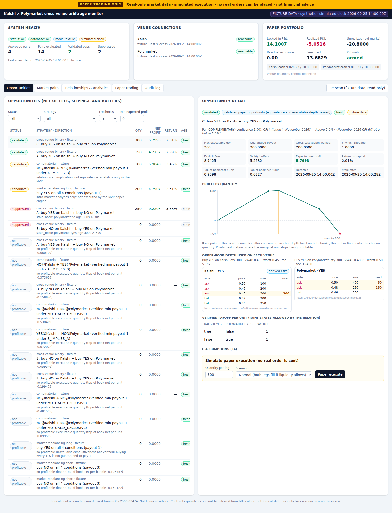
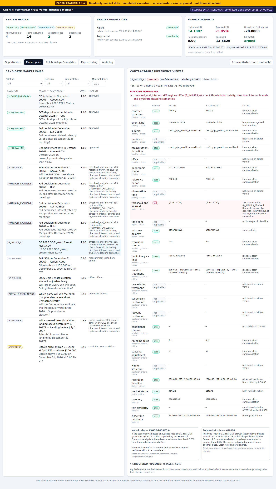
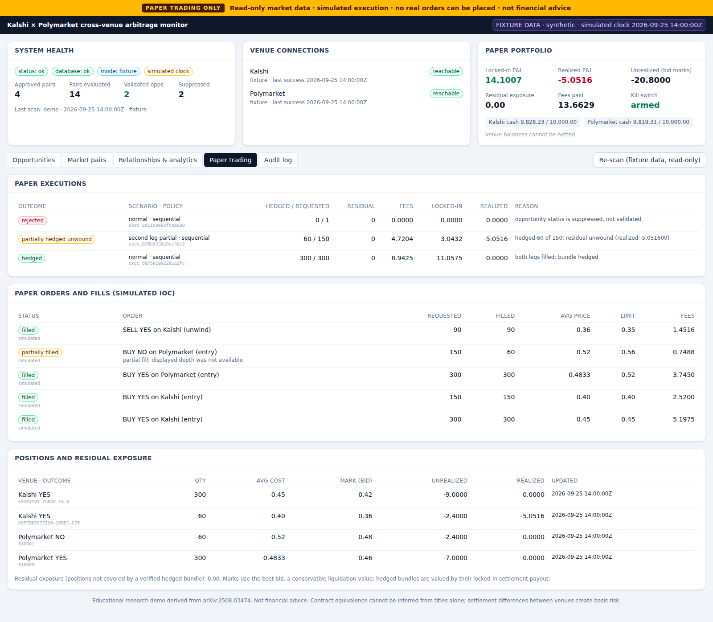

# prediction-market-cross-venue-arbitrage

**Paper trading only.** A read-only research system that looks for arbitrage between
[Kalshi](https://kalshi.com) and [Polymarket](https://polymarket.com) prediction markets,
built on the methodology of *Unravelling the Probabilistic Forest: Arbitrage in Prediction
Markets* ([arXiv:2508.03474](https://arxiv.org/abs/2508.03474)). It discovers candidate
contract pairs, verifies equivalence conservatively, normalizes both venues' order books,
prices depth-aware arbitrage after fees, slippage and buffers, and simulates non-atomic
two-leg execution in a deterministic paper engine.

It never places, signs or cancels a real order. There is no setting that enables live
trading (`PAPER_TRADING_ONLY=false` fails at startup) and no trading credential is read
anywhere. This is an educational demonstration, not financial advice.

> **Contract equivalence cannot be inferred from titles alone.** Two markets that read the
> same can resolve differently because of sources, deadlines, time zones, revisions,
> cancellation rules or rounding. Even pairs this system approves carry *basis risk*: venue
> settlement rules can diverge in ways text checks cannot see.



## What it does

| Stage | What happens | Code |
| --- | --- | --- |
| Discover | Lists active markets from Kalshi (`/events?with_nested_markets`) and Polymarket (Gamma `/markets/keyset`), paginated and rate-limited | `app/venues/*/client.py` |
| Normalize | Converts both venues into `NormalizedMarket` / `NormalizedOrderBook` (Decimal throughout; Kalshi asks derived as `1 − opposite bid`) | `app/venues/*/normalize.py` |
| Match | 6-stage pipeline: eligibility → canonicalization → candidate blocking → deterministic rule checks → relation classification (interval/state algebra, optional LLM veto) → conservative approval | `app/matching/` |
| Price | Walks both ask ladders together, stops at the first unprofitable marginal unit, applies documented fee formulas and buffers, gates stale/crossed/thin books | `app/arbitrage/` |
| Simulate | Two-leg paper execution with leg risk: partial fills, rejects, price moves, timeouts, outages, unwinds, residual exposure, kill switch | `app/execution/` |
| Observe | FastAPI + React dashboard, audit trail for every decision, structured logs, metrics | `app/api/`, `frontend/` |

The paper's two arbitrage families are both implemented: **market rebalancing** (Definition 3)
as depth-aware intra-venue analytics, and **combinatorial arbitrage** over dependent subsets
(Definitions 2 and 4), adapted across venues as a relation graph with payoff-verified
constructions. Only `EQUIVALENT` and provably `COMPLEMENTARY` pairs are executable in this
MVP. See [docs/PAPER_MAPPING.md](docs/PAPER_MAPPING.md).

## Quick start

Requirements: [uv](https://docs.astral.sh/uv/) (Python 3.12 is installed by uv if needed),
Node 22 with npm, and optionally Docker Compose v2. No credentials, no network needed for the
demo.

```bash
make install     # uv sync --frozen --all-extras (backend) + npm ci (frontend)
make demo        # deterministic end-to-end demo on fixtures (no network, no credentials)
make dev         # API on http://127.0.0.1:8000 (docs at /docs), dashboard on http://127.0.0.1:5173
```

`make demo` resets the local SQLite database, loads the fixtures through the real venue
normalizers, matches markets, prices books, paper-executes the validated opportunities and
prints a report that ends with acceptance checks:

```text
candidate reduction: 182 possible pairs -> 48 compared after blocking -> 14 candidates -> 4 approved
COMPLEMENTARY  yes 1.00  KXCPIYOY-26NOV-T3.0      <-> 610003
EQUIVALENT     yes 1.00  KXFEDDECISION-26DEC-C25  <-> 610001
AMBIGUOUS      no  0.50  KXBTCD-26DEC3117-T150000 <-> 610006   blocked by: resolution_source: differs
B_IMPLIES_A    no  1.00  KXGDP-26Q3-T3.0          <-> 610004   # ">= 3.0%" vs "> 3.0%"
...
[validated]  C: buy YES on Kalshi + buy YES on Polymarket  qty=300 fees=8.9425 buffers=5.2582 net=5.7993
[suppressed] A: buy YES on Kalshi + buy NO on Polymarket   reason: stale_book: polymarket:no age 300s > 30s
Paper executions:
- hedged (scenario normal): hedged 300 of 300 ... locked-in 11.0575
- partially_hedged_unwound (scenario second_leg_partial): hedged 60 of 150 ... realized -5.0516
Acceptance checks: 8 x [PASS]
```

One structured `WARNING` log line (`kalshi series unavailable … KXARTEMIS`) is expected: the
fixture set omits that series on purpose to exercise the conservative fee fallback.

After the demo, `make dev` shows the stored results in the dashboard (the API serves fixture
data with a simulated clock pinned to the fixture timestamp, so the opportunities stay fresh
and executable).

### Docker

```bash
make docker-up     # API on 127.0.0.1:8000, dashboard on 127.0.0.1:8080; the backend runs the demo on start
make docker-down
```

## Live read-only scan

```bash
make live-scan     # = cd backend && uv run python -m app.cli scan --live
```

Downloads currently active markets from both venues' public APIs, matches them, fetches
public books for approved (and implication) pairs, and reports net opportunities. It never
trades. "No pair passed validation" or "no profitable opportunity" are normal, valid results
— the matcher is deliberately strict and live markets are usually priced efficiently. Exit
codes: `0` scan completed, `3` venue data unavailable.

Operational notes: Kalshi's WebSocket requires API keys even for public channels, so Kalshi is
polled over REST; the Polymarket adapter supports the public market WebSocket with REST
polling fallback. If Kalshi's order-book endpoint ever demands credentials, the adapter falls
back to market-level top of book and flags the book as depth-limited.

## Commands

| Command | Purpose |
| --- | --- |
| `make install` | install locked dependencies |
| `make dev` | API + dashboard with reload |
| `make demo` | deterministic fixture demo |
| `make scan` / `make live-scan` | scan with `DATA_MODE` / live public data (read-only) |
| `make test` | backend pytest (unit, property, integration, security) + frontend vitest |
| `make lint` | ruff check, ruff format --check, eslint |
| `make typecheck` | mypy --strict (app and tests) + tsc |
| `make smoke` | Playwright: dashboard load + paper execution in Chromium |
| `make docker-up` / `make docker-down` | Docker Compose stack |
| `make fixtures` | regenerate the synthetic fixture set |

CLI (run from `backend/`):

```bash
uv run python -m app.cli health [--live|--fixture]
uv run python -m app.cli sync-markets [--live|--fixture]
uv run python -m app.cli match-markets [--live|--fixture]
uv run python -m app.cli scan [--live|--fixture]
uv run python -m app.cli demo
uv run python -m app.cli paper-execute --opportunity-id opp_9828e211663447c9 [--quantity 50] [--scenario second_leg_partial]
uv run python -m app.cli export-audit --output audit.jsonl
uv run python -m app.cli kill-switch-reset
uv run python -m app.cli reset-db
```

## API

OpenAPI docs at `http://127.0.0.1:8000/docs`. Main endpoints:

`GET /health` · `GET /api/venues` · `GET /api/markets` · `GET /api/market-pairs` ·
`POST /api/market-pairs/refresh` · `GET /api/opportunities` · `GET /api/opportunities/{id}` ·
`POST /api/paper/execute/{opportunity_id}` (requires `Idempotency-Key`) ·
`GET /api/paper/orders` · `GET /api/paper/positions` · `GET /api/paper/portfolio` ·
`POST /api/paper/kill-switch/reset` · `GET /api/relationships` · `GET /api/books/{venue}/{market}` ·
`GET /api/audit` · `GET /api/config/public` · `GET /metrics`

Every response carries `X-Paper-Trading-Only: true` and an `X-Correlation-ID`.

## Dashboard

Panels: system health, venue connection state, the paper-trading banner, live/fixture
indicator, candidate pairs with relation and confidence, a contract-rule difference viewer
(every check with both venues' values and full rules text), rejected-pair reasons, order-book
depth on both venues with the levels consumed, net opportunity after fees and buffers,
maximum executable quantity, profit by quantity, the paper-execution form with fault
scenarios, paper orders and fills, residual exposure, portfolio P&L, the relationship graph,
paper-derived analytics, and the audit log. Filters: venue status, relation, minimum
confidence, minimum expected profit, freshness, approved/rejected.

| Market pairs | Paper trading |
| --- | --- |
|  |  |

## Limitations

- **Read-only, paper-only.** No execution against any venue. See
  [docs/LIVE_TRADING_GAP_ANALYSIS.md](docs/LIVE_TRADING_GAP_ANALYSIS.md) for what would be needed.
- **The matcher is conservative by construction.** It recognizes common contract templates
  (elections, economic releases, central-bank decisions, asset price thresholds, events by a
  deadline). Anything it cannot read unambiguously is `AMBIGUOUS` and never approved, so on
  live data most pairs will be rejected. An optional LLM can only veto approvals.
- **Fees** follow the venues' published formulas (Kalshi schedule effective 2026-07-07;
  Polymarket fee guide). Rounding direction for Polymarket is not documented; costs are
  rounded up. Maker rebates, fee waivers and deposit/withdrawal costs are not modelled beyond
  the configurable settlement buffer.
- **Fixture data is synthetic.** Names, prices and dates are invented and labeled as fixture
  data everywhere.
- **Settlement and collateral.** Kalshi pays USD, Polymarket pays pUSD (a USDC-backed token
  on Polygon); the model treats both as 1:1 and does not model conversion, transfer times or
  counterparty risk beyond the buffers.
- **This build environment** could not reach the venue APIs or Docker Hub (proxy policy); see
  the verification notes in [docs/OPERATIONS.md](docs/OPERATIONS.md).

## Troubleshooting

| Symptom | Fix |
| --- | --- |
| `PAPER_TRADING_ONLY=false is not supported` | Intended. Live trading does not exist in this version. |
| Live scan exits with code 3 | A venue was unreachable (network, proxy, geography or outage). The error lines name the host and HTTP status. |
| Dashboard shows "API unreachable" | Start the API (`make dev-backend`) or set `VITE_API_PROXY` to its URL. |
| Opportunities are all "stale" | In live mode books expire after `BOOK_STALE_AFTER_SECONDS`; re-scan and execute promptly. |
| Kill switch engaged | Too many consecutive failed paper executions; reset it in the portfolio panel or `app.cli kill-switch-reset`. |
| Playwright cannot find a browser | `cd frontend && npx playwright install chromium` (or set `PLAYWRIGHT_BROWSERS_PATH`). |

## Documentation

- [ARCHITECTURE](docs/ARCHITECTURE.md) — components, data flow, sequence diagrams, calculations
- [PAPER_MAPPING](docs/PAPER_MAPPING.md) — paper definitions → code, adaptations
- [SOURCES](docs/SOURCES.md) — official documentation used, access dates, API assumptions
- [DECISIONS](docs/DECISIONS.md) — architectural decisions and trade-offs
- [SECURITY](docs/SECURITY.md) — paper-only guarantees, secrets, threat model, compliance
- [OPERATIONS](docs/OPERATIONS.md) — running, resetting, observability, recovery, verification log
- [LIVE_TRADING_GAP_ANALYSIS](docs/LIVE_TRADING_GAP_ANALYSIS.md) — what live trading would require
