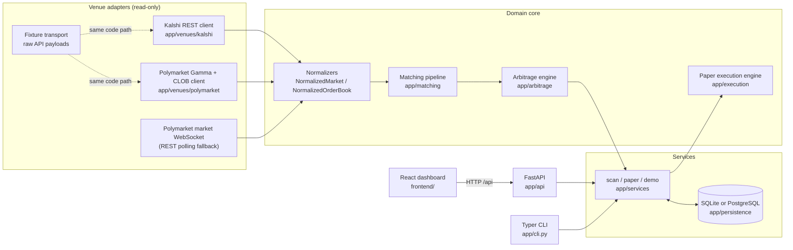
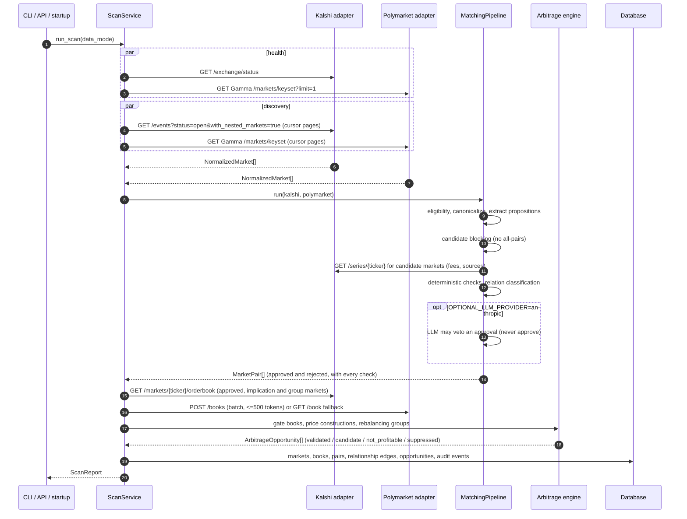
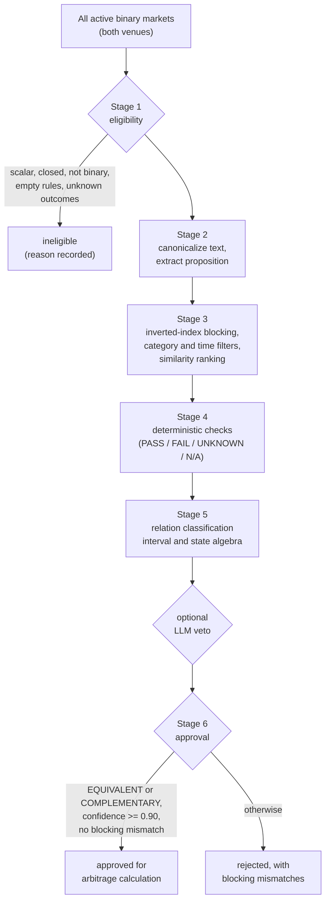
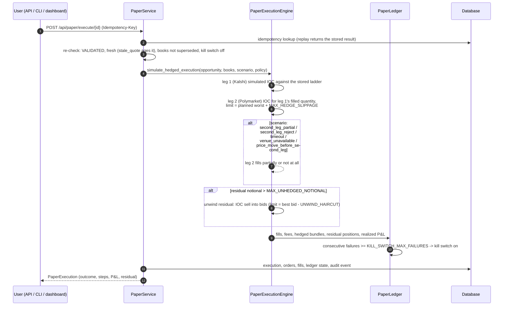

# Architecture

A modular monolith: one Python service (FastAPI + a Typer CLI over the same service layer)
and one React dashboard. Every module boundary is a typed interface, so venues, storage and
the relation adjudicator can be swapped without touching the arbitrage math.

## Components



| Layer | Package | Responsibility |
| --- | --- | --- |
| Core utilities | `app/core` | Settings, Decimal helpers, clocks, stable IDs, structured logging with redaction, metrics, read-only HTTP transport with retry/backoff and rate limiting |
| Domain | `app/domain` | Pydantic models (markets, books, pairs, opportunities, paper orders/fills/positions), enums, the venue interfaces |
| Venues | `app/venues` | Kalshi and Polymarket adapters and normalizers, the fixture transport, and a *disabled* live-execution stub |
| Matching | `app/matching` | Eligibility, canonicalization, proposition extraction, candidate blocking, deterministic checks, relation classification, optional LLM veto |
| Arbitrage | `app/arbitrage` | Fee models, payoff verification, depth-walking optimizer, quote gating, cross-venue calculator, market-rebalancing and combinatorial analytics |
| Execution | `app/execution` | Deterministic paper simulator and ledger (per-venue cash, positions, hedged bundles, kill switch) |
| Persistence | `app/persistence` | SQLAlchemy 2 async tables and a repository |
| Services | `app/services` | Composition root (`container.py`), scan, paper execution with idempotency, demo |
| Interfaces | `app/api`, `app/cli.py` | HTTP endpoints and CLI commands over the services |

### Venue interfaces

`app/domain/interfaces.py` defines three protocols:

- `MarketDataVenue`: `list_active_markets`, `get_market`, `get_order_book(s)`,
  `stream_order_books`, `healthcheck`. Implemented by the Kalshi and Polymarket adapters.
- `PaperExecutionVenue`: `simulate_order`, `cancel_simulated_order`. Implemented by the
  paper engine.
- `LiveExecutionVenue`: `place_order`, `cancel_order`. **Not implemented.** The only class
  that names it, `app/venues/live_execution_disabled.py`, raises `NotImplementedError` from
  every method and is imported nowhere. A security test parses every module's imports to
  keep it that way.

### Transports

Both live adapters talk to the network only through `ReadOnlyHttpTransport`
(`app/core/http.py`). It exposes `get_json` and `post_json_readonly`. The second accepts
only paths on a per-transport allow-list, which holds exactly one entry: Polymarket's
`POST /books`, a read-only batch order-book query. Any other POST raises
`ReadOnlyViolationError` before a request is built. There is no PUT, PATCH or DELETE, and no
code that builds signing headers.

The fixture transport (`app/venues/fixture.py`) implements the same interface and serves
the checked-in raw venue payloads in `fixtures/`, so the demo exercises the real
pagination, normalization and fallback code.

## Scan data flow



Order books are fetched only for markets that can produce a result: approved pairs,
implication pairs (combinatorial analytics) and rebalancing groups. The live scan never
downloads books for the whole universe.

## Matching pipeline



**Stage 2** turns a market into a `Proposition`: kind (election, policy decision,
economic data, asset price, occurrence), subject and metric, the YES region as an interval
set (for example `CPI YoY >= 3.0` is `[3.0, +inf)`), observation period, deadline and time
zone, resolution sources, first-release vs final value, revision, cancellation, recount and
conditional clauses, rounding and seasonal adjustment.

**Stage 4** compares both propositions field by field in six groups: identity (subject,
metric, office, geography, person), region, resolution criteria, status, timing and
optional fields. Every check records both venues' values.

**Stage 5** classifies the relation:

| Relation | Rule |
| --- | --- |
| `EQUIVALENT` / `COMPLEMENTARY` | identical subject and metric, YES regions equal (or exact complements), every criteria check PASS, no critical field UNKNOWN |
| `A_IMPLIES_B` / `B_IMPLIES_A` | YES region of one is a strict subset of the other (for example `>= 3.0%` vs `> 3.0%` or `by Dec 31` vs `by Jun 30`) |
| `MUTUALLY_EXCLUSIVE` | disjoint regions, or different candidates in the same single-winner race |
| `PARTIALLY_OVERLAPPING` | overlapping but neither contains the other, or different predicates on the same subject |
| `UNRELATED` | identity checks fail (different office, geography, metric or subject) |
| `AMBIGUOUS` | anything that cannot be read unambiguously: unknown time zone on a time-bounded proposition, differing or missing sources, revision or cancellation mismatch |

**Stage 6** approves only `EQUIVALENT` and `COMPLEMENTARY` at confidence >= 0.90 with no
blocking mismatch. Quote-level approval (both books fresh and well formed) happens later, in
`app/arbitrage/gating.py`. Until both pass, a result is called a *candidate*.

## Arbitrage calculations

For an approved pair and a leg mapping, every quantity is a `Decimal`:

```text
total_cost(q) = executable_cost_leg_1(q) + executable_cost_leg_2(q)
              + explicit_fees(q) + buffers(q)
net_profit(q) = guaranteed_payout(q) - total_cost(q)
```

- **Guaranteed payout** is computed, not assumed: `app/arbitrage/payoff.py` enumerates the
  joint (Kalshi YES, Polymarket YES) states the relation allows and takes the minimum payout
  of the construction. EQUIVALENT gives constructions A (YES@Kalshi + NO@Polymarket) and B
  (NO@Kalshi + YES@Polymarket). COMPLEMENTARY gives C (YES + YES) and D (NO + NO). Each pays
  exactly 1 per unit.
- **Executable cost** walks both ask ladders at once (`app/arbitrage/depth.py`). Kalshi
  publishes bids only, so its asks are derived as `1 - opposite bid`.
- **Fees** use each venue's published taker formula per consumed level with the venue's
  rounding (`app/arbitrage/fees.py`). Missing fee metadata falls back to a configurable,
  conservative rate. The fallback is recorded in the opportunity's assumptions.
- **Buffers** are a settlement/transfer buffer and a latency (execution-risk) buffer per
  unit, plus capital cost: the annual rate × days to the later resolution × deployed capital.
- **Optimizer**: the marginal net profit of each additional unit is non-increasing, because
  ladder prices are non-decreasing and `p + r·p(1−p)` is increasing in `p` for `r < 1`. The
  walk therefore takes every unit with positive marginal profit and stops at the first
  unprofitable unit, at book exhaustion, or at `MAX_TRADE_QUANTITY`. The result is then
  re-priced exactly with per-fill rounding. If rounding erases the edge, smaller breakpoints
  are tried.
- **Rounding**: costs round up (`ROUND_CEILING`), proceeds round down (`ROUND_FLOOR`),
  quantities floor to `QUANTITY_STEP`, ratios round half-even.
- **Status**: `SUPPRESSED` when a gate fails (stale, crossed, malformed, empty or thin book,
  market or venue not trading, no verified payout). `NOT_PROFITABLE` when no quantity
  clears costs. `CANDIDATE` when profitable but below `MIN_NET_PROFIT` or
  `MIN_RETURN_ON_CAPITAL`, or when the relation is only an implication. `VALIDATED` otherwise.
  Only `VALIDATED` opportunities are executable, and only while fresh.
- **Staleness**: an opportunity expires at the oldest book timestamp plus
  `BOOK_STALE_AFTER_SECONDS`.

Every opportunity carries its assumptions list (fee formulas and sources, buffers, capital
cost horizon, derived asks, depth limits, thresholds, optimizer stop reason), the profit
curve by quantity and the joint payoff table. The dashboard shows all three.

Market rebalancing (`rebalancing.py`) and combinatorial analytics (`combinatorial.py`)
reuse the same optimizer and gating, and are never marked `VALIDATED` in this MVP. See
[PAPER_MAPPING.md](PAPER_MAPPING.md).

## Paper execution and non-atomic risk

Cross-venue arbitrage cannot be atomic: the two legs sit on different venues with
different matching engines, settlement assets and latencies. The paper engine models what
can go wrong in between.



| Risk | How it is represented |
| --- | --- |
| Second leg rejected | `second_leg_reject`: leg 1 is naked, residual unwound or kept by threshold |
| Partial fill | `second_leg_partial`: leg 2 fills `PARTIAL_FILL_FRACTION` of leg 1 |
| Price moved between legs | `price_move_before_second_leg`: leg 2's ladder shifts by `ADVERSE_PRICE_MOVE`, and the slippage limit may block it |
| Stale quote | `stale_quote`: the quotes age past `stale_after` before submission and the execution is refused |
| Timeout | `timeout`: leg 2 is not acknowledged before the timeout and is treated as unfilled |
| Venue outage | `venue_unavailable`: leg 2's venue refuses the connection |
| Repeated failures | kill switch blocks further executions until reset |
| Unhedged exposure | residual positions marked at best bid, reported in the portfolio |

Two policies exist. `sequential` (the default) sends Kalshi first, then hedges the filled
quantity on Polymarket after a simulated latency. `simultaneous_ioc` sends both against the
same snapshot. Cash is tracked per venue, because in reality capital on Kalshi (USD) and
Polymarket (pUSD on Polygon) cannot be moved instantly.

## Persistence

SQLAlchemy 2 async with SQLite by default (`DATABASE_URL`) and PostgreSQL via `asyncpg`
(`cd backend && uv sync --extra postgres`, or `BACKEND_EXTRAS="--extra postgres"` for the Docker image). Tables: `scan_runs`, `markets`, `order_books`,
`market_pairs`, `relationship_edges`, `opportunities`, `paper_executions`, `paper_orders`,
`paper_fills`, `paper_state`, `audit_events`, `idempotency_keys`, `venue_health`. Domain
objects are stored as validated JSON documents plus indexed columns for filtering.
Timestamps are timezone-aware UTC. The schema is created at startup with `create_all`.
There is no migration tool yet (see [DECISIONS.md](DECISIONS.md)).

## Observability

- Structured JSON logs (`LOG_JSON=true`, the default) carrying `correlation_id`, `venue`, `market_id`,
  `pair_id`, `opportunity_id` and `paper_order_id` from context variables. A redaction filter
  removes PEM blocks, bearer tokens, `*_key=`/`secret=`-style values, `sk-` keys, 64-hex
  strings and seed-phrase-like strings.
- `GET /metrics` (JSON) and `GET /metrics?format=prometheus`: request, retry and error
  counters per venue, last successful venue call, markets listed, pairs evaluated, approved
  and rejected, opportunities by status, stale books, normalization errors, WebSocket
  failures, desyncs and fallbacks, and paper executions by outcome.
- Every response carries `X-Correlation-ID` and `X-Paper-Trading-Only: true`.
- The audit trail (`audit_events`) records scans, every pair decision with its checks,
  opportunities with assumptions, paper executions with the books used, and kill-switch
  changes. Export it with `python -m app.cli export-audit --output audit.jsonl`.

## Frontend

React 19 + TypeScript + Vite + Tailwind 4. `frontend/src/api.ts` is the only module that
talks to the API. Components are small and tested with Vitest and Testing Library, and a
Playwright smoke test drives the real backend. Freshness is judged against the service
clock returned by `/health` (simulated in fixture mode), never the browser clock. The
paper-trading banner is always rendered and cannot be dismissed.
